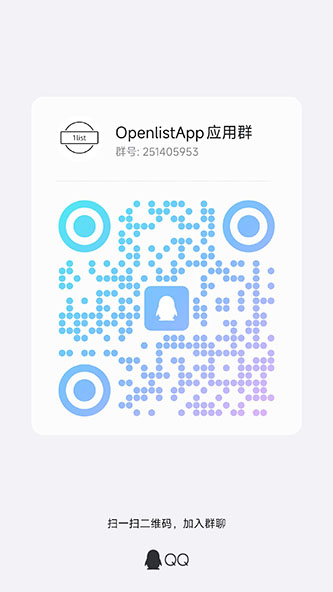
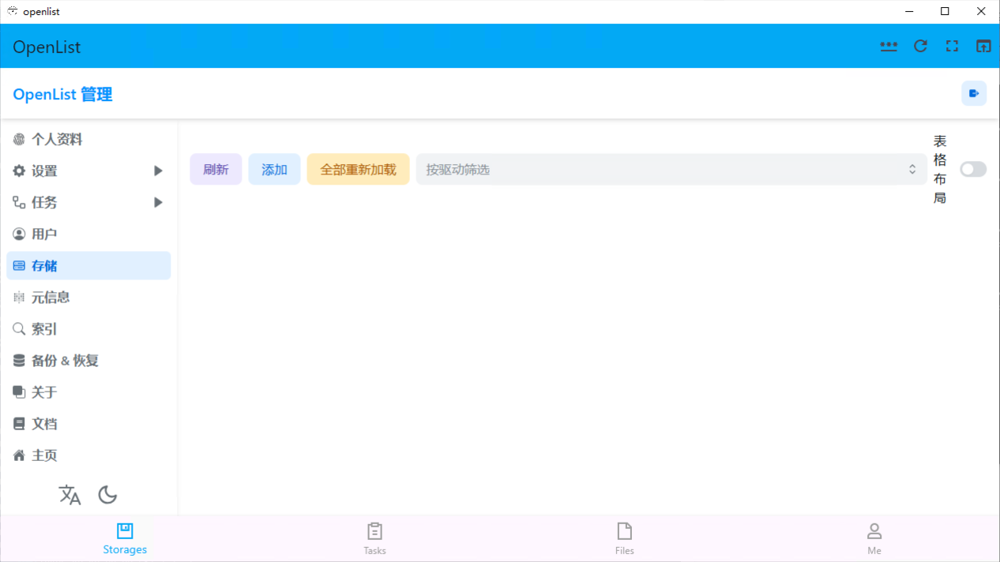

# OpenList App
### 一个AList、OpenList跨平台客户端,目前内置OpenList服务器，不需要额外连接服务器，支持iOS、macOS、Windows、Android、Linux

### 内置[DDNS-GO(MIT)](https://github.com/jeessy2/ddns-go)，如果设备具**有公网IP**可以借助DDNS-GO进行远程访问,将手机当做远程服务器

### 内置[GATEWAY-GO(MIT)](https://github.com/OpenIoTHub/gateway-go)，如果设备**没有公网IP**可以借助GATEWAY-GO进行远程访问,将手机当做远程服务器

### 通过CI构建，本项目不提供api服务器，服务器由上游OpenList等社区提供
### 项目提供两套UI，一套是原先的Web界面直接加载，另一套是目前已经开发完核心功能的原生界面，目前默认Linux使用原生界面其他都使用Web界面

### 本项目作为前端项目参考AList前端项目以宽松的[MIT](LICENSE)代码许可证发布，欢迎改包名后发布应用市场（特别是iOS），需要始终声明基于本项目开发的项目(带本项目地址)

#### 关于编译本项目：
* 需要从[OpenListLib](https://github.com/OpenListApp/OpenListLib/releases)下载相关库进行编译

### QQ群:251405953

### 项目结构
* [openlist](/lib/main.dart)APP入口项目
* [openlist_api](/openlist_api)核心api封装
* [openlist_utils](/openlist_utils)工具
* [openlist_background_service](/openlist_background_service)openlist(AList)库封装
* [openlist_global](/openlist_global)全局共享代码
* [openlist_config](/openlist_config)配置文件
* [openlist_native_ui](/openlist_native_ui) 原生界面代码
* [openlist_web_ui](/openlist_web_ui)web界面代码(目前默认使用)

     

### 注意事项：
* 初始用户遵从上游默认权限，代表着默认webdav不开启，请注意
* 其他