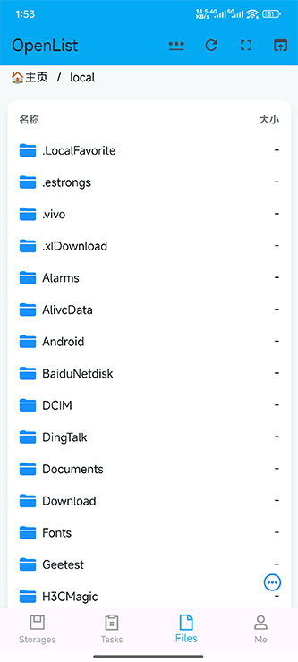

# OpenList App
### 一个AList、OpenList跨平台客户端，支持iOS、macOS、Windows、Android、Linux

    

### 通过CI构建、代码上传谷歌Dart pub.dev的方式留备份解决大家广泛关心的安全性问题(目前由于库达到几百兆上传不上，但是目前全部CI构建)，本项目不提供api服务器，服务器由上游OpenList等社区提供
### 项目提供两套UI，一套是原先的Web界面直接加载，另一套是目前已经开发完核心功能的原生界面，目前默认Linux使用原生界面其他都使用Web界面
### 项目结构
 * [openlist](/lib/main.dart)APP入口项目
 * [openlist_api](/openlist_api)核心api封装
 * [openlist_utils](/openlist_utils)工具
 * [openlist_background_service](/openlist_background_service)openlist(AList)库封装
 * [openlist_global](/openlist_global)全局共享代码
 * [openlist_config](/openlist_config)配置文件
 * [openlist_native_ui](/openlist_native_ui) 原生界面代码
 * [openlist_web_ui](/openlist_web_ui)web界面代码(目前默认使用)
